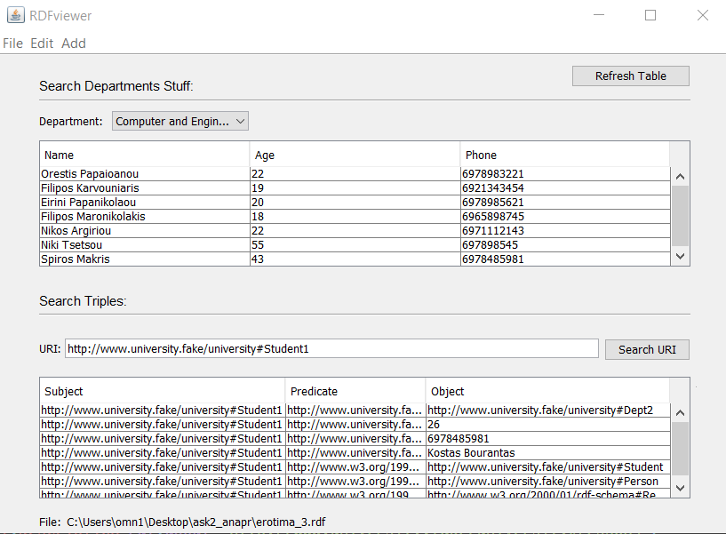

# RDFViewer
A RDF Viewer/Editor made with Java and JenaAPI. You can find the executable at dist folder and an sample RDF file in order to use it.
The source code of the project is saved at src folder. To run the project from the command line, go to the dist folder and
type the following: java -jar "RDFViewer.jar" .

